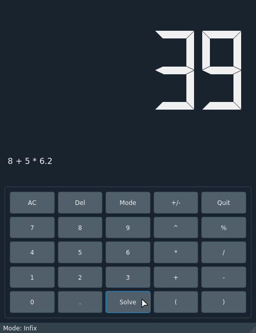
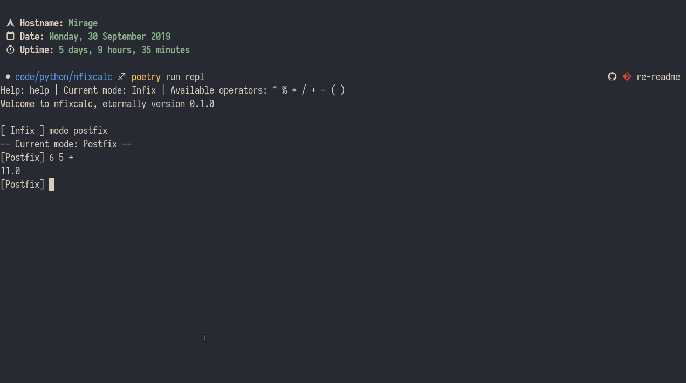

<h1 align="center">nfixcalc</h1>
<p align="center">
A GUI and REPL calculator for Infix, Postfix and Prefix equations.<br><br>
</p>

## Manual Installation
### Requirements
* Python 3.8
* [Poetry](https://github.com/sdispater/poetry)

### Steps
1. Clone the repository.
2. Change into the repository directory.
```sh
$ cd nfixcalc
```
3. Install dependencies with `poetry`.
```sh
$ poetry install
```

## Run the program
To run the REPL:
```sh
$ poetry run repl
```
To run the GUI:
```sh
$ poetry run gui
```

## Screenshots
<p align="center">




</p>

## License
This project is licensed under MIT. For more information see the [LICENSE](https://github.com/kosayoda/nfixcalc/blob/master/LICENSE) file.
